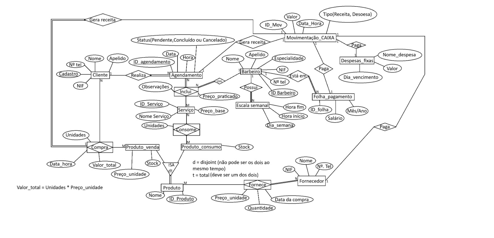
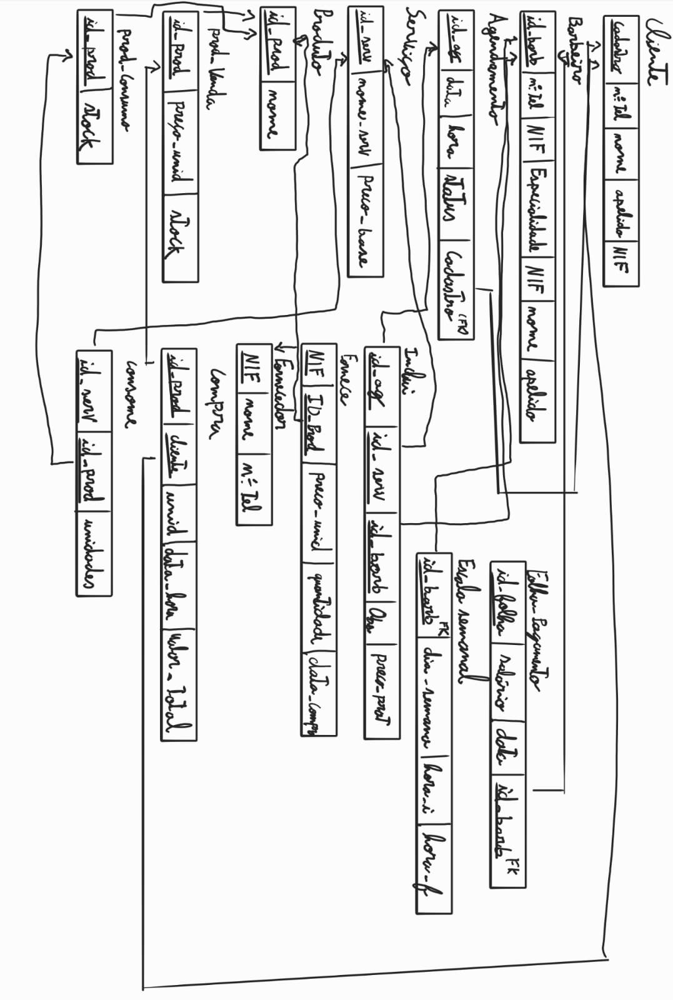

# BD: Trabalho Prático APFE

**Grupo**: P3G1
- Rúben Pequeno, MEC: 102480
- Eduardo Assis, MEC: 134391

## Introdução / Introduction
 
Este trabalho propõe o desenvolvimento de um sistema de gestão para uma barbearia/cabeleireiro onde são os próprios barbeiros que gerem os seus horários, atendem os clientes e realizam as vendas de produtos. O sistema permite o agendamento de serviços com um barbeiro específico, controla o stock de produtos para o cabelo e regista todas as receitas e despesas do negócio. Através de uma estrutura simples mas completa, pretende-se oferecer uma ferramenta que facilite a gestão deste tipo de negócios.

## Análise de Requisitos / Requirements

### 1. Requisitos Funcionais

#### A. Gestão de Clientes e Agendamentos
- **Cadastro de Clientes**: O sistema deve permitir registar nome, apelido, telefone, NIF e numero de cadastro.
- **Controlo de Agenda**: Deve ser possível marcar horários associando um Cliente a um Barbeiro e a um ou mais Serviços.
- **Status de Agendamento**: O sistema deve gerir o ciclo de vida do agendamento (Pendente, Concluído ou Cancelado).

#### B. Gestão de Recursos Humanos (Barbeiros)
- **Perfil do Barbeiro**: Registo de dados pessoais, NIF e especialidade.
- **Escala de Trabalho**: O sistema deve controlar os dias da semana e horários (início/fim) em que cada barbeiro está disponível.
- **Folha de Pagamento**: Deve calcular ou registar o salário mensal/anual de cada colaborador.

#### C. Gestão de Serviços e Vendas
- **Catálogo de Serviços**: Definição de serviços com preço base.
- **Venda de Produtos**: O sistema deve permitir a venda direta de produtos ao cliente (ex: ceras, shampoos), calculando o valor total (`Unidades x Preco_unidade`).
- **Consumo Interno**: Deve registar quais produtos de consumo (ex: golas descartáveis, loções) são utilizados em cada serviço para baixar o stock automaticamente.

#### D. Gestão de Stock e Fornecedores
- **Diferenciação de Produtos**: O sistema deve distinguir entre "Produto de Venda" e "Produto de Consumo" (Herança/Especialização Total e Disjunta).
- **Compras**: Registo de entrada de mercadoria com controlo de preço de custo, quantidade e data da compra junto aos fornecedores.

#### E. Gestão Financeira (Fluxo de Caixa)
- **Movimentação de Caixa**: Centralização de todas as entradas (receitas de serviços e vendas) e saídas (pagamento de salários e despesas fixas).
- **Controlo de Despesas**: Gestão de custos fixos (renda, luz, água) com data de vencimento.

### 2. Regras de Negócio
- **Herança de Produtos**: Um produto tem de ser obrigatoriamente ou de venda ou de consumo (Restrição `t` - total), mas nunca os dois simultaneamente (Restrição `d` - disjoint).
- **Cálculo de Receita**: Toda a conclusão de um Agendamento ou uma Compra (venda para o cliente) deve gerar automaticamente um registo de "Receita" na tabela de `Movimentacao_CAIXA`.
- **Atualização de Stock**:
	- Uma Compra (venda ao cliente) deve subtrair do stock de `Produto_venda`.
	- Um Serviço realizado deve subtrair do stock de `Produto_consumo` com base na quantidade por unidade (ml/un).
- **Pagamentos**: A `Folha_pagamento` e as `Despesas_fixas` devem estar vinculadas a uma saída na `Movimentacao_CAIXA`.

## DER

## ER

