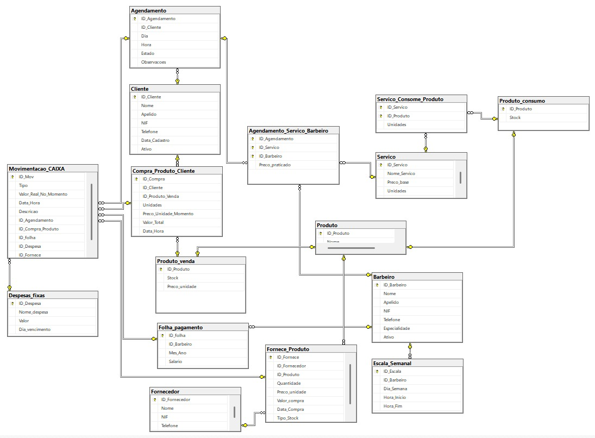
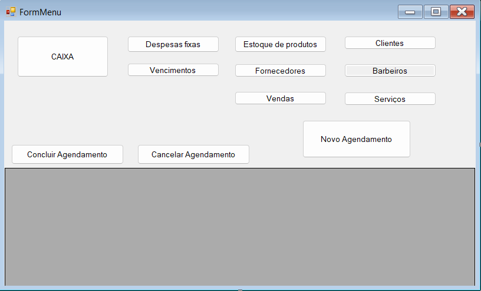

# BD: Trabalho Prático APF-T

**Grupo**: P3G1
- Rúben Pequeno, MEC: 102480
- Eduardo Assis, MEC: 134391

## Introdução
 
Este trabalho propõe o desenvolvimento de um sistema de gestão para uma barbearia onde são os próprios barbeiros que gerem os seus horários, atendem os clientes e realizam as vendas de produtos. O sistema permite o agendamento de serviços com um barbeiro específico, controla o stock de produtos para o cabelo e regista todas as receitas e despesas do negócio. Através de uma estrutura simples mas completa, pretende-se oferecer uma ferramenta que facilite a gestão deste tipo de negócios.

## ​Análise de Requisitos

## DER - Diagrama Entidade Relacionamento

### Versão final


### Melhorias

Não houveram alterações em relação à entrega anterior.

## ER - Esquema Relacional

### Versão final



### Melhorias

Não houveram alterações em relação à entrega anterior.

## ​SQL DDL - Data Definition Language

[SQL DDL File](sql/01_ddl.sql "SQLFileQuestion")

## SQL DML - Data Manipulation Language

Uma secção por formulário.
A section for each form.

### Formulario exemplo



```sql
-- Show data on the form
SELECT ​

        A.ID_Agendamento,​

        C.Nome AS [Nome Cliente],​

        B.Nome AS [Nome Barbeiro],​

        A.Dia AS [Data],​

        A.Hora AS [Horário],​

        SUM(ASB.Preco_praticado) AS [Valor Total],​

        A.Estado AS [Estado]​

    FROM dbo.Agendamento A​

    INNER JOIN dbo.Cliente C ON A.ID_Cliente = C.ID_Cliente​

    INNER JOIN dbo.Agendamento_Servico_Barbeiro ASB ON A.ID_Agendamento = ASB.ID_Agendamento​

    INNER JOIN dbo.Barbeiro B ON ASB.ID_Barbeiro = B.ID_Barbeiro​

    GROUP BY A.ID_Agendamento, C.Nome, B.Nome, A.Dia, A.Hora, A.Estado​

    ORDER BY A.Dia DESC, A.Hora ASC;​

-- Insert new element
INSERT INTO MY_TABLE ....;
```

...

## Normalização/Normalization

Descreva os passos utilizados para minimizar a duplicação de dados / redução de espaço.
Justifique as opções tomadas.
Describe the steps used to minimize data duplication / space reduction.
Justify the choices made.

## Índices

Não foram utilizados nenhum tipo de índices.

## SQL Programming: Stored Procedures, Triggers, UDF

[SQL SPs and Functions File](sql/02_sp_functions.sql "SQLFileQuestion")

[SQL Triggers File](sql/03_triggers.sql "SQLFileQuestion")

## Outras notas

### Dados iniciais da dabase de dados

[SQL DB Init File](sql/04_db_init.sql "SQLFileQuestion")

### User Defined Functions

[SQL UDFs](sql/05_udfs.sql "SQLFileQuestion")

### Apresentação

[Slides](slides.pdf "Sildes")

[Video](https://youtu.be/Rt6E7eiSwtw)


 
