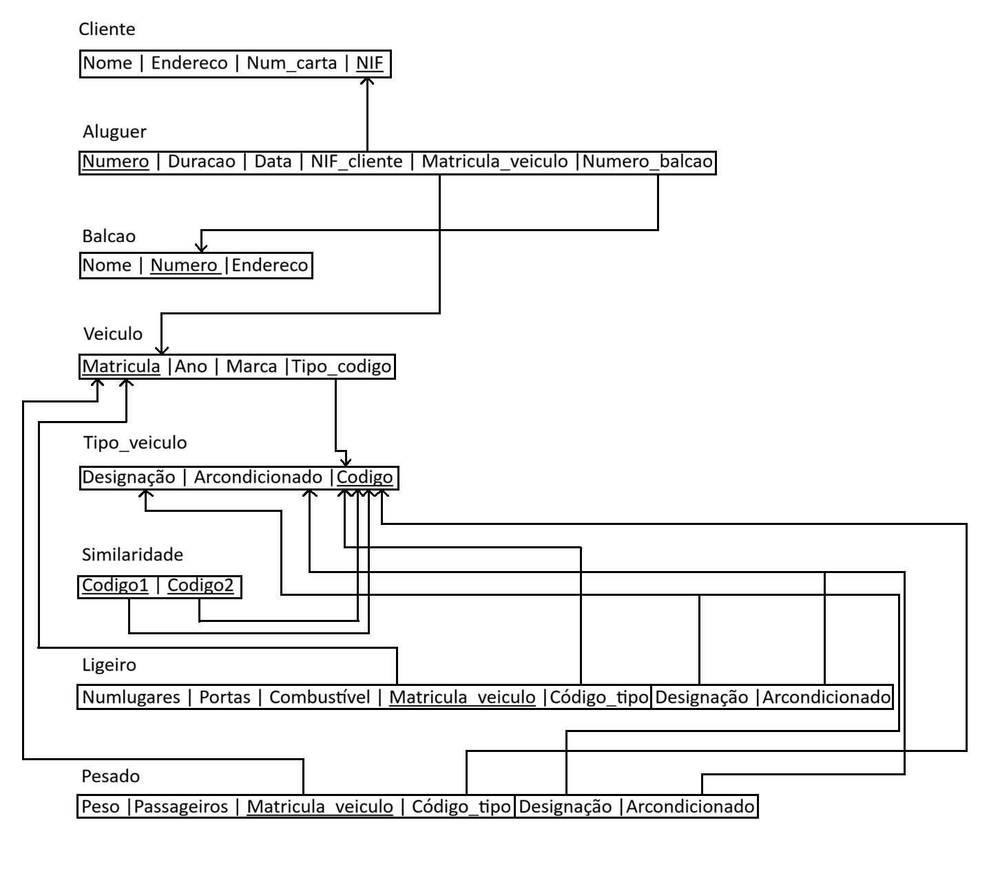
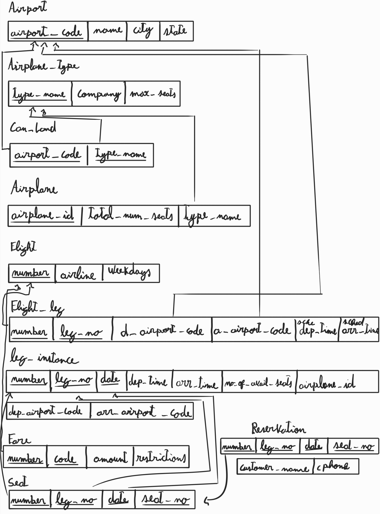
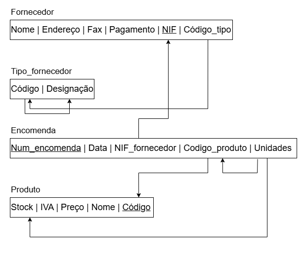
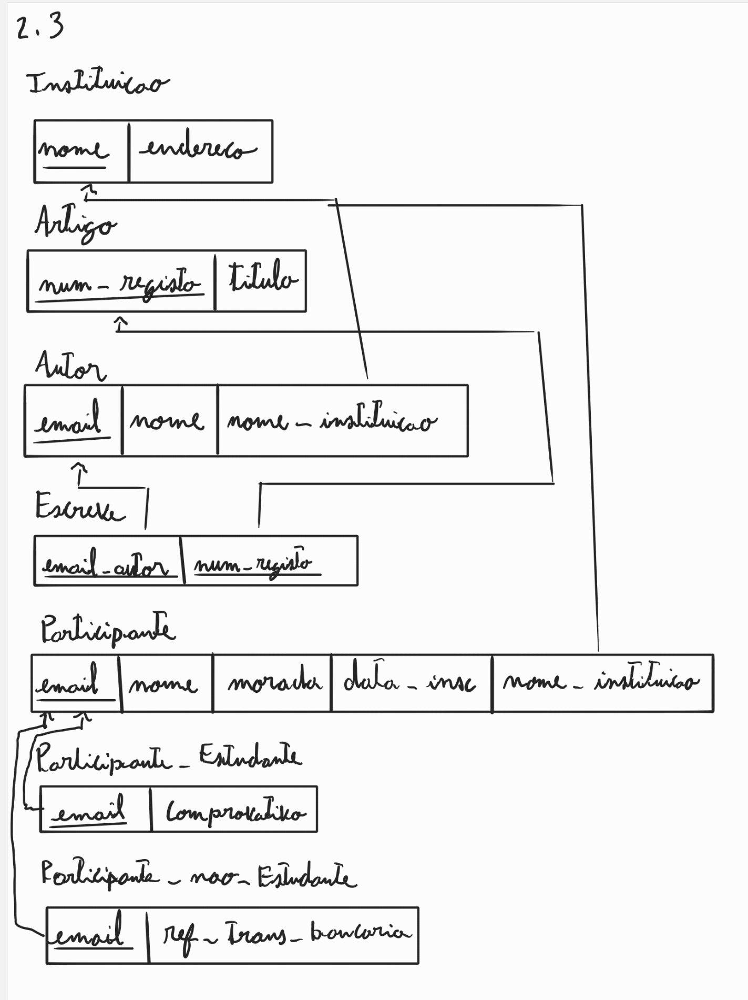
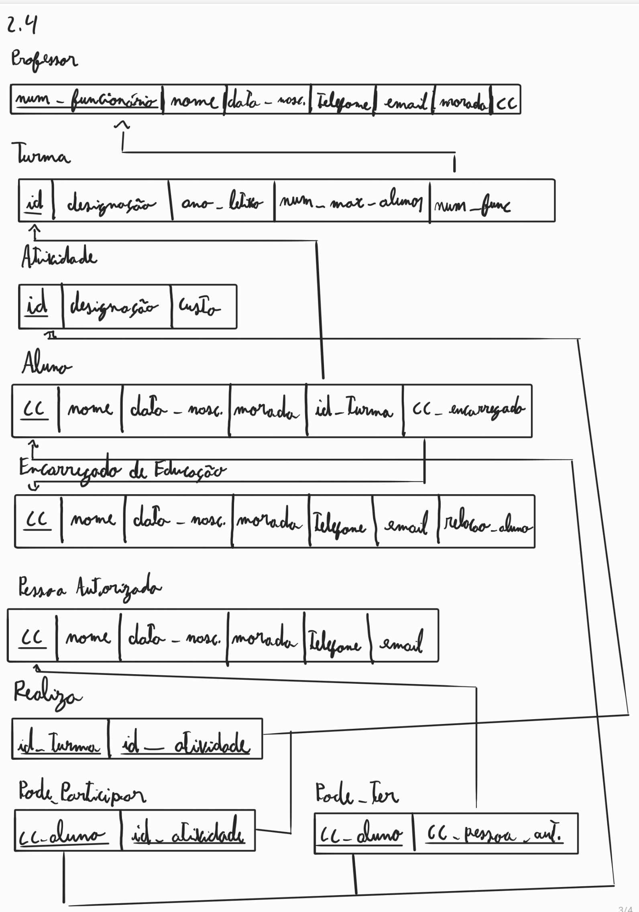

# BD: Guião 3


## ​Problema 3.1
 
### *a)*

```
CLIENTE(NIF (PK), nome, endereco, num_carta)
BALCAO(numero (PK), nome, endereco)
TIPO_VEICULO(designacao, arcondicionado, codigo (PK))
VEICULO(matricula (PK), marca, ano, tipo_designacao)
LIGEIRO(matricula (PK), codigo, numlugares, portas, combustivel)
PESADO(matricula (PK), peso, passageiros)
ALUGUER(numero (PK), data, duracao, NIF_cliente, num_balcao, matricula_veiculo)
SIMILARIDADE(codigo1 (PK), codigo2 (PK))
```


### *b)* 

```
Relação,  Chave Primária (PK),  Chaves Candidatas (CK),   Chaves Estrangeiras (FK)
CLIENTE,        NIF,                "NIF, num_carta",            ---
BALCAO,        numero,                  numero,                  ---
TIPO_VEICULO,  codigo,                  codigo,                  ---
VEICULO,      matricula,               matricula,         tipo_designacao → TIPO_VEICULO
LIGEIRO,      matricula,           "matricula, codigo",     matricula → VEICULO
PESADO,       matricula,               matricula,           matricula → VEICULO
ALUGUER,       numero,            NIF_cliente → CLIENTE,    num_balcao → BALCAO, matricula_veiculo → VEICULO
SIMILARIDADE,"codigo1, codigo2",  "codigo1, codigo2",       codigo1 → TIPO_VEICULO; codigo2 → TIPO_VEICULO
```


### *c)* 




## ​Problema 3.2

### *a)*

```
AIRPORT(airport_code (PK) | name | city | state)
AIRPLANE_TYPE(type_name (PK) | company | max_seats)
CAN_LAND(airport_code (PK)(FK) | type_name (PK)(FK))
AIRPLANE(airplane_id (PK) | total_no_of_seats | type_name (FK))
FLIGHT(number (PK) | airline | weekdays)
FLIGHT_LEG(number (PK)(FK) | leg_no (PK) | departure_airport_code (FK) | arrival_airport_code (FK) | scheduled_dep_time | scheduled_arr_time)
LEG_INSTANCE(number (PK)(FK) | leg_no (PK)(FK) | date (PK) | dep_time | arr_time | no_of_avail_seats | airplane_id (FK) | dep_airport_code (FK) | arr_airport_code (FK))
FARE(number (PK)(FK) | code (PK) | amount | restrictions)
SEAT(number (PK)(FK) | leg_no (PK)(FK) | date (PK)(FK) | seat_no (PK))
RESERVATION(number (PK)(FK) | leg_no (PK)(FK) | date (PK)(FK) | seat_no (PK)(FK) | customer_name | cphone)
```


### *b)* 

```
... Write here your answer ...
```


### *c)* 




## ​Problema 3.3


### *a)* 2.1



### *b)* 2.2


### *c)* 2.3



### *d)* 2.4





