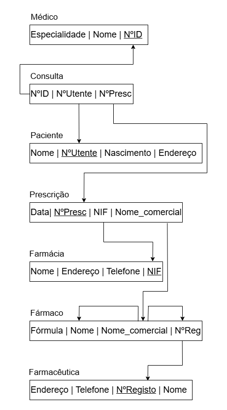

# BD: Guião 3


## ​Problema 3.1
 
### *a)*

```
CLIENTE(N͟I͟F, nome, endereco, num_carta)
BALCAO(n͟u͟m͟e͟r͟o, nome, endereco)
TIPO_VEICULO(designacao, arcondicionado, c̲o̲d̲i̲g̲o̲)
VEICULO(m͟a͟t͟r͟i͟c͟u͟l͟a, marca, ano, tipo_designacao)
LIGEIRO(m͟a͟t͟r͟i͟c͟u͟l͟a, codigo, numlugares, portas, combustivel)
PESADO(m͟a͟t͟r͟i͟c͟u͟l͟a, peso, passageiros)
ALUGUER(n͟u͟m͟e͟r͟o, data, duracao, NIF_cliente, num_balcao, matricula_veiculo)
SIMILARIDADE(c͟o͟d͟i͟g͟o͟1͟|c͟o͟d͟i͟g͟o͟2͟)
```


### *b)* 

```
Relação,  Chave Primária (PK),  Chaves Candidatas (CK),   Chaves Estrangeiras (FK)
CLIENTE,        NIF,                "NIF, num_carta",            ---
BALCAO,        numero,                  numero,                  ---
TIPO_VEICULO,  codigo,                  codigo,                  ---
VEICULO,      matricula,               matricula,         tipo_designacao → TIPO_VEICULO
LIGEIRO,      matricula,           "matricula, codigo",     matricula → VEICULO
PESADO,       matricula,               matricula,           matricula → VEICULO
ALUGUER,       numero,            NIF_cliente → CLIENTE,    num_balcao → BALCAO, matricula_veiculo → VEICULO
SIMILARIDADE,"codigo1, codigo2",  "codigo1, codigo2",       codigo1 → TIPO_VEICULO; codigo2 → TIPO_VEICULO
```


### *c)* 


## ​Problema 3.2

### *a)*

```
... Write here your answer ...
```


### *b)* 

```
... Write here your answer ...
```


### *c)* 


## ​Problema 3.3


### *a)* 2.1


### *b)* 2.2



### *c)* 2.3


### *d)* 2.4


